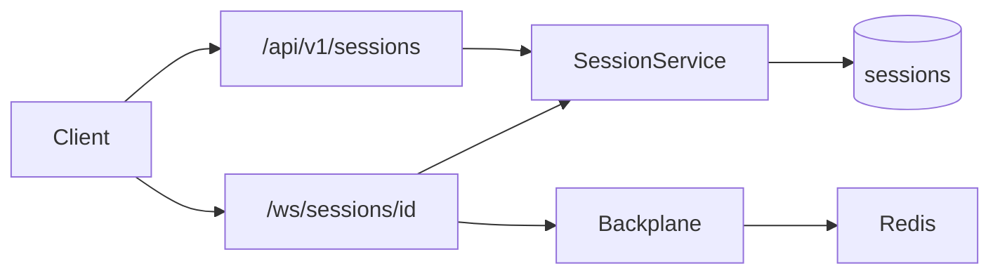

# Sessions and WebSocket

Backend guide for game **sessions** (pre-game rooms), the public **lobby**, and **realtime** chat over WebSocket.

**Base URL (local):** `http://localhost:8002`  
**REST prefix:** `/api/v1`  
**WebSocket:** `/ws/sessions/{session_id}`

---

## Overview

| Term | Meaning |
|------|---------|
| **Session** | A room in MongoDB (`sessions` collection). Holds members, invite code, and status before/during a game. |
| **Lobby** | REST-only listing of **public**, **waiting** rooms (`GET /api/v1/sessions`). |
| **Realtime** | WebSocket connection after you have joined the session via REST. |



**Rules of thumb**

1. Register or log in → obtain a JWT.
2. Create or join a session via REST (membership is stored in MongoDB).
3. Connect WebSocket with the same JWT; the server checks membership before accepting.
4. Send chat (and respond to heartbeats) over WS; messages fan out via Redis when multiple API instances run.

**Limits**

- Max **8** players per session (`max_players` in API responses).
- Session statuses: `waiting` → `in_progress` → `finished` (only `waiting` is joinable today).

---

## Running locally

### Prerequisites

- Docker (recommended), or local MongoDB + Redis matching [`.env.example`](../.env.example).

### Setup

```bash
cd MonopolyBE
cp .env.example .env
# Edit JWT_SECRET_KEY for non-local use
docker compose -f docker-compose.dev.yml up
```

The API listens on **port 8002**. Health checks:

- `GET /health` — liveness
- `GET /ready` — Mongo + Redis connectivity

### Environment variables

| Variable | Purpose |
|----------|---------|
| `MONGODB_URI` / `MONGODB_DB` | Session and user persistence |
| `REDIS_URL` | WebSocket backplane pub/sub |
| `JWT_SECRET_KEY` / `JWT_EXPIRE_MINUTES` | Bearer tokens |
| `CORS_ORIGINS` | Comma-separated origins (e.g. `http://localhost:3000`) |

Inside Docker Compose, `MONGODB_URI` and `REDIS_URL` point at the `mongodb` and `redis` services automatically.

---

## Authentication

All session endpoints and WebSocket connections require a valid JWT.

| Method | Path | Description |
|--------|------|-------------|
| `POST` | `/api/v1/auth/register` | Create account; returns user + token |
| `POST` | `/api/v1/auth/login` | Login; returns user + token |
| `GET` | `/api/v1/auth/me` | Current user profile |

### Register

```bash
curl -s -X POST http://localhost:8002/api/v1/auth/register \
  -H "Content-Type: application/json" \
  -d '{
    "email": "host@example.com",
    "password": "password123",
    "display_name": "Host"
  }'
```

Response (201):

```json
{
  "user": {
    "id": "...",
    "email": "host@example.com",
    "display_name": "Host",
    "created_at": "..."
  },
  "token": {
    "access_token": "<JWT>",
    "token_type": "bearer",
    "expires_in": 3600
  }
}
```

Save `token.access_token` for later requests:

```bash
export TOKEN="<access_token>"
```

### Authenticated REST calls

```bash
curl -s http://localhost:8002/api/v1/auth/me \
  -H "Authorization: Bearer $TOKEN"
```

---

## Sessions REST API

All routes below require:

```http
Authorization: Bearer <access_token>
```

### Endpoints

| Method | Path | Description |
|--------|------|-------------|
| `POST` | `/api/v1/sessions` | Create a room |
| `GET` | `/api/v1/sessions` | List public lobby (`waiting` + `public`) |
| `GET` | `/api/v1/sessions/{session_id}` | Session detail |
| `GET` | `/api/v1/sessions/by-code/{invite_code}` | Lookup by invite code |
| `POST` | `/api/v1/sessions/{session_id}/join` | Join by session ID |
| `POST` | `/api/v1/sessions/join-by-code` | Join by invite code |
| `POST` | `/api/v1/sessions/{session_id}/leave` | Leave room (204, no body) |
| `DELETE` | `/api/v1/sessions/{session_id}/members/{user_id}` | Host kick (waiting only) |
| `POST` | `/api/v1/sessions/{session_id}/start` | Host starts game |

### Create session

**Body is required.** Omitting it returns `422`.

```bash
curl -s -X POST http://localhost:8002/api/v1/sessions \
  -H "Authorization: Bearer $TOKEN" \
  -H "Content-Type: application/json" \
  -d '{"visibility": "public"}'
```

`visibility`: `"public"` | `"private"` (default: `"public"`).

Response (201): `{ "session": { ... } }` — see [Response shapes](#response-shapes).

The host is added automatically with `your_role: "host"`. An **invite code** is generated (e.g. `TYC-A1B2`).

### Invite codes

- Format: `TYC-` + 4 characters from `A–Z` and `0–9` (regex: `^TYC-[A-Z0-9]{4}$`).
- Codes are normalized to uppercase on the server.
- Matches the frontend pattern in `MonopolyFE/src/features/landing/JoinWithCode.tsx`.

### Public lobby

```bash
curl -s "http://localhost:8002/api/v1/sessions?limit=20" \
  -H "Authorization: Bearer $TOKEN"
```

Returns only sessions that are **`public`**, **`waiting`**, and not full. Private rooms never appear here.

Pagination: optional `cursor` from the previous response’s `next_cursor` (opaque `created_at|session_id` string).

### Get session detail

```bash
curl -s http://localhost:8002/api/v1/sessions/{session_id} \
  -H "Authorization: Bearer $TOKEN"
```

**Access rules**

- Members always see full detail including `members` and `your_role`.
- Non-members may read **public** sessions in **`waiting`** status (preview before join).
- Otherwise → `403 Not a member`.

### Lookup by invite code

```bash
curl -s http://localhost:8002/api/v1/sessions/by-code/TYC-A1B2 \
  -H "Authorization: Bearer $TOKEN"
```

Non-members can preview a session in **`waiting`** status. If the game has already started → `409` (not joinable).

### Join

**By session ID** (typical for public lobby):

```bash
curl -s -X POST http://localhost:8002/api/v1/sessions/{session_id}/join \
  -H "Authorization: Bearer $GUEST_TOKEN"
```

**By invite code** (typical for private rooms):

```bash
curl -s -X POST http://localhost:8002/api/v1/sessions/join-by-code \
  -H "Authorization: Bearer $GUEST_TOKEN" \
  -H "Content-Type: application/json" \
  -d '{"invite_code": "TYC-A1B2"}'
```

Join works for any **waiting** session if you know the ID or code (including private). Re-joining when already a member returns the current session (`200`). Join after **start** → `409`.

### Leave

```bash
curl -s -X POST http://localhost:8002/api/v1/sessions/{session_id}/leave \
  -H "Authorization: Bearer $TOKEN"
```

Returns `204`. If the host leaves, the earliest remaining member becomes host. If the room is empty, it is deleted.

### Host kick

```bash
curl -s -X DELETE \
  "http://localhost:8002/api/v1/sessions/{session_id}/members/{target_user_id}" \
  -H "Authorization: Bearer $HOST_TOKEN"
```

Only the **host** may kick, only while status is **`waiting`**. Host cannot kick themselves (`400`).

### Start game

```bash
curl -s -X POST http://localhost:8002/api/v1/sessions/{session_id}/start \
  -H "Authorization: Bearer $HOST_TOKEN"
```

Sets `status` to `in_progress`. Only the host may start; only from **`waiting`**. After start, new joins return `409`.

### Response shapes

**`SessionSummary`** (lobby list items):

| Field | Type | Notes |
|-------|------|-------|
| `id` | string | Session UUID |
| `invite_code` | string | e.g. `TYC-A1B2` |
| `status` | string | `waiting`, `in_progress`, `finished` |
| `visibility` | string | `public`, `private` |
| `member_count` | int | Current players |
| `max_players` | int | Always `8` |
| `host` | object | `{ "id", "display_name" }` |
| `created_at` | datetime | ISO 8601 |

**`SessionDetail`** (create/join/get): all summary fields plus:

| Field | Type | Notes |
|-------|------|-------|
| `members` | array | `{ user_id, display_name, role, joined_at }` |
| `your_role` | string \| null | `host` or `player` if you are a member |

`role` values: `host`, `player`.

---

## End-to-end flows

### 1. Host creates a public room

```bash
# Register host
HOST_RESP=$(curl -s -X POST http://localhost:8002/api/v1/auth/register \
  -H "Content-Type: application/json" \
  -d '{"email":"host@example.com","password":"password123","display_name":"Host"}')
HOST_TOKEN=$(echo "$HOST_RESP" | jq -r '.token.access_token')

# Create session (body required)
SESSION_RESP=$(curl -s -X POST http://localhost:8002/api/v1/sessions \
  -H "Authorization: Bearer $HOST_TOKEN" \
  -H "Content-Type: application/json" \
  -d '{"visibility":"public"}')
SESSION_ID=$(echo "$SESSION_RESP" | jq -r '.session.id')
INVITE_CODE=$(echo "$SESSION_RESP" | jq -r '.session.invite_code')
```

### 2. Guest joins from lobby

```bash
GUEST_RESP=$(curl -s -X POST http://localhost:8002/api/v1/auth/register \
  -H "Content-Type: application/json" \
  -d '{"email":"guest@example.com","password":"password123","display_name":"Guest"}')
GUEST_TOKEN=$(echo "$GUEST_RESP" | jq -r '.token.access_token')

# List lobby
curl -s http://localhost:8002/api/v1/sessions \
  -H "Authorization: Bearer $GUEST_TOKEN"

# Join by ID
curl -s -X POST "http://localhost:8002/api/v1/sessions/$SESSION_ID/join" \
  -H "Authorization: Bearer $GUEST_TOKEN"
```

### 3. Guest joins a private room by code

```bash
# Host creates private room, shares INVITE_CODE
curl -s -X POST http://localhost:8002/api/v1/sessions/join-by-code \
  -H "Authorization: Bearer $GUEST_TOKEN" \
  -H "Content-Type: application/json" \
  -d "{\"invite_code\":\"$INVITE_CODE\"}"
```

### 4. WebSocket chat

See [WebSocket protocol](#websocket-protocol). You must **join via REST first**; connecting without membership closes with code `4403`.

Browser / client libraries: pass the JWT in the WebSocket subprotocol (not the query string):

```http
Sec-WebSocket-Protocol: bearer,<access_token>
```

Example using `wscat` (if installed):

```bash
wscat -c "ws://localhost:8002/ws/sessions/$SESSION_ID" \
  -s "bearer,$HOST_TOKEN"
```

After connect, the first message is `system.welcome`. Send a chat message (JSON text frame):

```json
{
  "v": 1,
  "type": "chat.send",
  "ts": "2026-05-29T12:00:00+00:00",
  "payload": { "text": "Hello, world!" }
}
```

You receive `chat.message` with `seq` plus an enriched payload
(`message_id`, `from_user_id`, `display_name`, `text`, `ts`) — enough to render the
author without a second lookup. See [Chat message](#chat-message-server-broadcast).

Send a sticker the same way with `chat.sticker_send`; you receive a `chat.sticker` broadcast:

```json
{
  "v": 1,
  "type": "chat.sticker_send",
  "ts": "2026-05-29T12:00:00+00:00",
  "payload": { "sticker_url": "/stickers/kolobki/012.tgs" }
}
```

### 5. Host starts the game

```bash
curl -s -X POST "http://localhost:8002/api/v1/sessions/$SESSION_ID/start" \
  -H "Authorization: Bearer $HOST_TOKEN"
```

Further join attempts return `409`.

---

## WebSocket protocol

### Connection

| Item | Value |
|------|-------|
| URL | `ws://localhost:8002/ws/sessions/{session_id}` |
| Auth | `Sec-WebSocket-Protocol: bearer,<access_token>` |
| Membership | Must be a session member **before** the server calls `accept` |

If auth or membership fails, the socket closes **without** a normal post-handshake welcome:

| Close code | When |
|------------|------|
| `4401` | Missing or invalid JWT |
| `4403` | Valid user but not a session member |
| `4400` | Unsupported protocol version `v` (after an in-band error; see below) |

### Message envelope

All frames are **JSON text**. Common shape:

```json
{
  "v": 1,
  "type": "<message_type>",
  "ts": "2026-05-29T12:00:00+00:00",
  "seq": 42,
  "idempotency_key": "optional-client-key",
  "payload": { }
}
```

| Field | Required | Notes |
|-------|----------|-------|
| `v` | yes | Protocol version; must be `1` |
| `type` | yes | Handler routing key |
| `ts` | yes | ISO 8601 timestamp (UTC recommended) |
| `seq` | server outbound | Monotonic per session on fan-out |
| `idempotency_key` | optional | Reserved; dedupe not implemented yet |
| `payload` | yes | Type-specific object |

> **Field casing:** the wire format is **`snake_case`** for both REST and WebSocket
> (`from_user_id`, `display_name`, `invite_code`, …). This matches the existing FE auth client;
> transform to `camelCase` at the FE boundary (e.g. in your Zod schemas) if your feature code prefers it.

### Message types (v1)

| Direction | `type` | `payload` |
|-----------|--------|-----------|
| Server → client | `system.welcome` | `session_id`, `your_seq_start` |
| Server → client | `connection.ping` | `{}` |
| Client → server | `connection.pong` | `{}` |
| Client → server | `chat.send` | `text` (1–1000 chars) |
| Server → client | `chat.message` | `message_id`, `from_user_id`, `display_name`, `text`, `ts` (+ `seq`) |
| Client → server | `chat.sticker_send` | `sticker_url` (must match `^/stickers/[\w-]+/[\w.-]+$`, ≤256 chars) |
| Server → client | `chat.sticker` | `message_id`, `from_user_id`, `display_name`, `sticker_url`, `ts` (+ `seq`) |
| Server → client | `session.updated` | `session` (full `SessionDetail`; `your_role` is always `null` — derive your own role from `session.members`) |
| Server → client | `system.error` | `code`, `message`, optional `ref_seq` |

**Welcome** (first message after accept):

```json
{
  "v": 1,
  "type": "system.welcome",
  "ts": "...",
  "payload": {
    "session_id": "...",
    "your_seq_start": 0
  }
}
```

**Chat send** (client):

```json
{
  "v": 1,
  "type": "chat.send",
  "ts": "2026-05-29T12:00:00+00:00",
  "idempotency_key": "my-uuid",
  "payload": { "text": "Hello, world!" }
}
```

**Chat message** (server broadcast):

```json
{
  "v": 1,
  "type": "chat.message",
  "ts": "...",
  "seq": 1,
  "payload": {
    "message_id": "9f1c0d8e4b7a4a2e9c3f5d6a7b8c9d0e",
    "from_user_id": "...",
    "display_name": "Host",
    "text": "Hello, world!",
    "ts": "2026-05-29T12:00:00.123456+00:00"
  }
}
```

> **Payload fields**
> - `message_id` — server-generated UUID (hex). Use it as a stable React key and for client-side dedupe.
> - `display_name` — resolved from the sender's session membership; render this directly.
> - `ts` — server timestamp inside the payload (mirrors the envelope `ts`). The envelope `seq` is a separate monotonic ordering key.
> - The server does **not** send a token/avatar color. Map `from_user_id` → color/avatar on the client using the member list from `SessionDetail`.

**Sticker send** (client):

```json
{
  "v": 1,
  "type": "chat.sticker_send",
  "ts": "2026-05-29T12:00:00+00:00",
  "payload": { "sticker_url": "/stickers/kolobki/012.tgs" }
}
```

`sticker_url` must be a `/stickers/<pack>/<file>` path served by the frontend (validated against
`^/stickers/[\w-]+/[\w.-]+$`, max 256 chars). Anything else — absolute URLs, traversal, extra
segments — is rejected as a `malformed` error.

**Sticker message** (server broadcast):

```json
{
  "v": 1,
  "type": "chat.sticker",
  "ts": "...",
  "seq": 2,
  "payload": {
    "message_id": "1a2b3c4d5e6f7a8b9c0d1e2f3a4b5c6d",
    "from_user_id": "...",
    "display_name": "Host",
    "sticker_url": "/stickers/kolobki/012.tgs",
    "ts": "2026-05-29T12:00:05.000000+00:00"
  }
}
```

**Session updated** (server broadcast):

Sent to every connected member whenever membership changes — on **join**, **leave**
(including automatic host hand-off), **kick**, and **start**. Use it to live-refresh the
lobby roster, host badge, and `status` without polling.

```json
{
  "v": 1,
  "type": "session.updated",
  "ts": "...",
  "seq": 3,
  "payload": {
    "session": {
      "id": "...",
      "invite_code": "TYC-A1B2",
      "status": "waiting",
      "visibility": "public",
      "member_count": 2,
      "max_players": 8,
      "host": { "id": "...", "display_name": "Host" },
      "created_at": "...",
      "members": [
        { "user_id": "...", "display_name": "Host", "role": "host", "joined_at": "..." },
        { "user_id": "...", "display_name": "Guest", "role": "player", "joined_at": "..." }
      ],
      "your_role": null
    }
  }
}
```

> `your_role` is always `null` in this broadcast because the same frame goes to every member.
> Compute your role client-side by matching your `user_id` against `session.members[].role`.
> Note: a kicked member is **not** force-disconnected from the socket yet — the `session.updated`
> frame is the client's signal to leave the room view.

### Heartbeat

Every **20s** the server sends `connection.ping`. Reply with `connection.pong` to refresh your last-pong time. If no pong within **25s**, the server closes the connection (`1001`).

### In-band error codes

Delivered as `system.error` (connection stays open unless noted):

| `payload.code` | Typical cause |
|----------------|---------------|
| `malformed` | Invalid JSON or envelope shape |
| `unsupported_version` | `v` ≠ 1; connection then closes with `4400` |
| `unknown_type` | No handler for `type` |
| `unauthorized` | Reserved |
| `not_member` | Reserved |
| `rate_limited` | Reserved |
| `internal` | Handler failure |

Example:

```json
{
  "v": 1,
  "type": "system.error",
  "ts": "...",
  "payload": {
    "code": "unknown_type",
    "message": "Unknown message type: foo.bar"
  }
}
```

### Multi-instance fan-out

Chat is published to Redis and delivered to all connections on the session, including other API replicas. See `tests/gateway/test_backplane_fanout.py`.

---

## HTTP errors

REST errors use JSON: `{ "detail": "<message>" }` (FastAPI `AppError` handler).

| Status | Exception / situation |
|--------|------------------------|
| `400` | Host cannot kick themselves |
| `401` | Missing/invalid bearer; invalid login |
| `403` | Not a member; non-host kick/start |
| `404` | Session or user not found |
| `409` | Email already registered; session full; already a member; session not joinable (wrong status) |
| `422` | Validation error (e.g. missing create body, bad invite code length) |

Session-specific cases:

| Situation | Status |
|-----------|--------|
| Join after `start` | `409` |
| Session has 8 players | `409` |
| Private session `GET` by non-member | `403` |
| Preview ended game via `by-code` | `409` |

---

## Not implemented yet

The following are intentionally out of scope for the current backend:

- Game engine and turn logic
- Idempotency key deduplication in Redis
- Seq replay / catch-up for reconnecting clients
- Rate limiting on chat (error code exists but is not enforced)
- Force-disconnecting a kicked member's open WebSocket (they receive `session.updated` instead)

---

## Running tests

From `MonopolyBE/`:

```bash
pip install -e ".[dev]"
pytest
```

Executable references:

| Area | Tests |
|------|-------|
| REST sessions | `tests/sessions/test_sessions_api.py` |
| WS membership | `tests/sessions/test_ws_membership.py` |
| Chat + fan-out | `tests/gateway/test_chat_handler.py`, `test_backplane_fanout.py` |
| Shared helpers | `tests/conftest.py` (`register_user`, `create_session`) |

---

## Source reference

| Topic | File |
|-------|------|
| Session domain | `src/domain/session/model.py` |
| Session service | `src/application/services/session_service.py` |
| REST routes | `src/api/sessions/router.py` |
| REST DTOs | `src/protocol/rest/sessions.py` |
| WS endpoint | `src/gateway/router.py` |
| WS dispatch | `src/gateway/dispatcher.py` |
| WS handlers (chat, sticker, pong) | `src/gateway/handlers/chat.py`, `src/gateway/handlers/__init__.py` |
| WS message DTOs | `src/protocol/ws/messages.py` |
| Invite codes | `src/core/invite_code.py` |
| Exceptions | `src/core/exceptions.py` |
